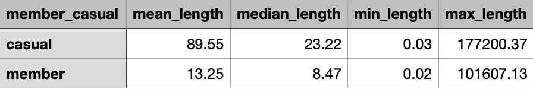
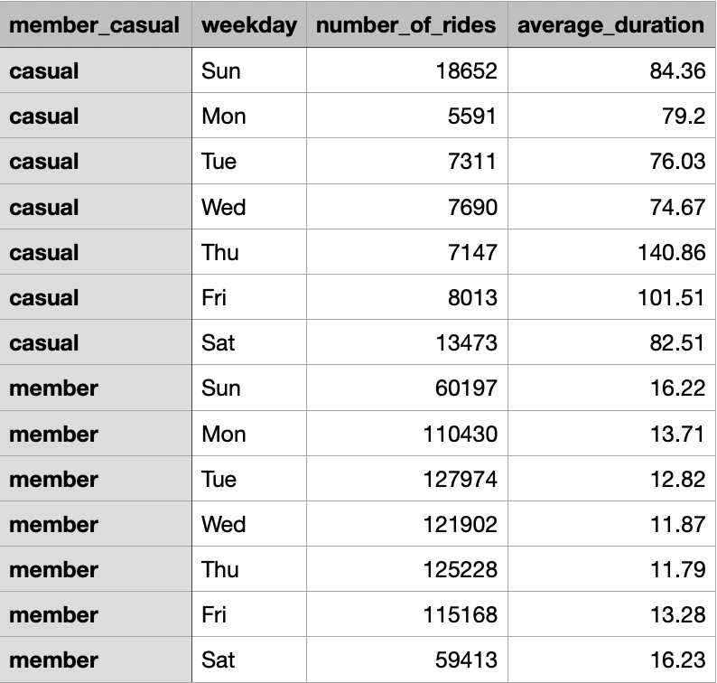
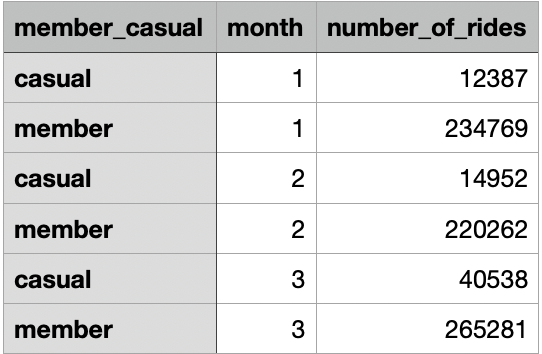
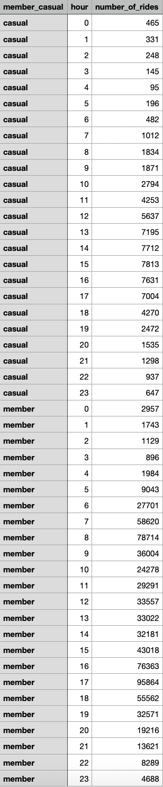

# Case Study: Cyclistic Bike-Share Analysis (Google Data Analytics Capstone)

## Introduction

This project presents an analysis of the Cyclistic Bike-Share case study, part of the Google Data Analytics Professional Certificate capstone. The goal is to address key business questions using the six-step data analysis process: Ask, Prepare, Process, Analyze, Share, and Act. 

## Background

Cyclistic is a bike-share program based in Chicago, featuring 5,824 bicycles and 692 docking stations across the city. Unlike other bike-share companies, Cyclistic offers a range of bicycles, including those designed for people with disabilities—such as reclining bikes, hand tricycles, and cargo bikes—making the service more inclusive and accessible.

Cyclistic also provides flexible pricing options: single-ride passes, full-day passes, and annual memberships, allowing it to appeal to a broad range of users, however, the company’s marketing director believes future success lies in increasing the number of annual memberships.

## Scenario

In this hypothetical scenario, I am a junior data analyst on Cyclistic’s marketing analytics team. I will present my findings and recommendations to key stakeholders, including the Marketing Director, Lily Moreno, and the Cyclistic executive team.
 
## Step 1: Ask

The business task at hand is to understand the ways annual members and casual riders use Cyclistic bikes differently. By understanding how each type of rider uses Cyclistic we will be able to determine patterns of usage over time which can then be used to design targeted marketing strategies to convert as many casual riders as possible into annual members. 

## Step 2: Prepare

### Does the Data ROCCC?

When approaching the prepare section it's critical to ensure data is reliable, original, comprehensive, current and cited. The data being used comes from Cyclistic's divvy trip data pertaining to both 2019 Q1 and 2020 Q1 and has been made available by Motivate International Inc. under their [Data License Agreement](https://divvybikes.com/data-license-agreement). Because R was used for analysis, only Q1 data was used due to size and format limitations with RStudios free plan. 

The data is public and can be used to investigate how different customer types are using Cyclistic bikes. In order to comply with data privacy issues the data excludes riders personally identifiable information including names or financial details. 

In order to determine whether or not the data source is reliable, original, comprehensive, current and cited I will follow the ROCCC framework. I know the data is reliable and original because it contains accurate, complete and unbiased information on Cyclistic's historical bike trips which come from a primary source. The data also contains all information needed to understand the different ways annual and casual riders use Cyclistic bikes making it quite comprehensive. Additionally because the data sources are provided publicly by Cyclistic it can be referenced easily. Although the data is from 5-6 years ago making it not current, it remains relevant for analyzing user behavior.

### Preparing RStudio

The necessary packages tidyverse and conflicted were installed and the conflict_prefer command was used to ensure consistency.

```r
# Install necessary packages
install.packages("tidyverse")
install.packages("conflicted")
library(tidyverse) 
library(conflicted)

# Set dplyr::filter and dplyr::lag as the default choices
conflict_prefer("filter", "dplyr")
conflict_prefer("lag", "dplyr")
```

The read_csv() function was then used to create dataframes for both years of data.

```r
# Using read_csv, create dataframes for each year
q1_2019 <- read_csv("Divvy_Trips_2019_Q1.csv")
q1_2020 <- read_csv("Divvy_Trips_2020_Q1.csv")
```

## Step 3: Process

The processing stage involves cleaning and transforming the data to ensure accuracy, consistency, and readiness for analysis. This includes removing incomplete or innaccurate entries and aligning column names/data types across datasets.

### Renaming columns
The column names in the 2019 data were renamed to match the 2020 schema, and the ride_id and rideable_type columns were explicitly converted to the character data type to allow for correct stacking  

```r
# Rename columns to make them consistent with q1_2020
(q1_2019 <- rename(q1_2019
                   ,ride_id = trip_id
                   ,rideable_type = bikeid
                   ,started_at = start_time
                   ,ended_at = end_time
                   ,start_station_name = from_station_name
                   ,start_station_id = from_station_id
                   ,end_station_name = to_station_name
                   ,end_station_id = to_station_id
                   ,member_casual = usertype))

# Convert ride_id and rideable_type to character so that they can stack correctly
q1_2019 <-  mutate(q1_2019, ride_id = as.character(ride_id)
                   ,rideable_type = as.character(rideable_type))
```

### Combining Datasets

The cleaned quarterly data frames were combined into a single master data frame, all_trips.

```r
# Stack individual quarter's data frames
all_trips <- bind_rows(q1_2019, q1_2020)
```

### Removing Unwanted Columns

Unnecessary columns (like birthyear, gender, and specific station coordinates) that were dropped from the public data in 2020 were removed for consistency.

```r
# Remove non essential columns
all_trips <- all_trips %>%  
  select(-c(start_lat, start_lng, end_lat, end_lng, birthyear, gender, tripduration))
```

### Standardizing user type data

The 2019 user type labels ("Subscriber" and "Customer") were standardized to match the 2020 labels ("member" and "casual") using the recode() function. 

```r
# Standardize user type labels
all_trips <-  all_trips %>% 
  mutate(member_casual = recode(member_casual,"Subscriber" = "member","Customer" = "casual"))
```

### Adding columns

New columns were created to extract granular time data (month, day, year, day-of-week) from the started_at timestamp, and the ride_length column was calculated by finding the difference between the end and start times. The unit used and data type for the ride_length column is also converted to minutes and numeric.

```r
# Add columns that list the date, month, day, and year of each ride
all_trips$date <- as.Date(all_trips$started_at)
all_trips$month <- format(as.Date(all_trips$date), "%m")
all_trips$day <- format(as.Date(all_trips$date), "%d")
all_trips$year <- format(as.Date(all_trips$date), "%Y")
all_trips$day_of_week <- format(as.Date(all_trips$date), "%A")

# Add a ride_length calculation to all_trips, specificy unit is minutes and round to two decimal places
all_trips$ride_length <-round(as.numeric(difftime(all_trips$ended_at, all_trips$started_at, units = "mins")), 2)
```

### Cleaning combined dataset

After noticing the presence of negative values in the ride_length column and invalid entries in the start_station_name, a new dataframe (all_trips_v2) is created to filter out these non-usable entries. 

```r
# Create a new dataframe (all_trips_v2) to filter out invalid entries
# Remove rides with negative duration and the 'HQ QR' station, which is known to be a test/placeholder station
all_trips_v2 <- all_trips[!(all_trips$start_station_name == "HQ QR" | all_trips$ride_length<0),]
```

## Step 4: Analyze

### Descriptive Analysis on ride length by user type

Key descriptive statistics were calculated for the ride length of bike trips seperated by user type. Descriptvie statistics were transfered into a summary table for a concise output and the dataframe was exported as a csv.

```r
# Create a new data frame with all the key statistics, rounded to 2 decimal places
summary_stats_df <- all_trips_v2 %>%
  group_by(member_casual) %>%
  summarise(
    mean_length = round(mean(ride_length), 2),
    median_length = round(median(ride_length), 2),
    min_length = round(min(ride_length), 2),
    max_length = round(max(ride_length), 2)
  )

# Export the dataframe to a csv file
write_csv(summary_stats_df, "summary_ride_statistics_tidy.csv")
```

Results:



### Average Ride Length in seconds and total number of rides by user type and weekday

Average ride length and total number of rides for each weekday by user type were calculated. A data frame was then created to display the calculations and was exported as a csv.

```r
# Create a new data frame with total number of rides and average ride length by weekday and user type
rides_duration_and_count <- all_trips_v2 %>%
  mutate(weekday = wday(started_at, label = TRUE)) %>%
  group_by(member_casual, weekday) %>%
  summarise(
    number_of_rides = n(),
    average_duration = round(mean(ride_length), 2), # Rounded to 2 decimal places
    .groups = 'drop'
  ) %>%
  arrange(member_casual, weekday)

# Export the dataframe to a csv file
write_csv(rides_duration_and_count, "daily_rides_and_duration_summary.csv")
```

Results:



### Analyzing monthly usage trends

Number of rides for each user type across each month of the data set is calculated and a datframe was created and exported as a csv file.

```r
# Group the data by user type and month, then summarize the total number of rides
monthly_rides <- all_trips_v2 %>%
  group_by(member_casual, month) %>%
  summarise(number_of_rides = n()) %>%
  arrange(month, member_casual)

# Export the dataframe to a csv file
write_csv(monthly_rides, "monthly_rides_summary.csv")
```

Results:



### Analyzing hourly usage trends

Number of rides for each user type by the hour of the day (military time) us calculated and a dataframe was crated and expoirted as a csv file.

```r
# Group the data by user type and hour, then sumarize the tital number of rides
hourly_data <- all_trips_v2 %>%
  mutate(hour = lubridate::hour(started_at)) %>%
  group_by(member_casual, hour) %>%
  summarise(number_of_rides = n())

# Export the dataframe to a csv file
write_csv(hourly_data, "hourly_rides_by_user_type.csv")
```

Results:



### Analyzing top 10 start stations 

The top 10 most popular starting locations were calculated for both casual and member riders. A dataframe was created and exported as a csv file. 

```r
# Create a data frame showing the top 10 start stations for each user type
top_starts_by_user <- all_trips_v2 %>%
  group_by(member_casual, start_station_name) %>%
  summarise(ride_count = n(), .groups = 'drop') %>%
  arrange(member_casual, desc(ride_count)) %>%
  group_by(member_casual) %>%
  slice_head(n = 10)

# Export the dataframe to a csv file
write_csv(top_starts_by_user, "top_10_start_stations_by_user.csv")
```

Results:


## Step 5: Share

### Total Number of rides each day of the week by user type

A grouped bar chart was created using ggplot2 to visualize the number of rides with bars grouped by "weekeday" and colored by "member_casual". 

```r
# Visualize the number of rides by rider type and weekday
all_trips_v2 %>% 
  mutate(weekday = wday(started_at, label = TRUE)) %>% 
  group_by(member_casual, weekday) %>% 
  summarise(number_of_rides = n()
            ,average_duration = mean(ride_length)) %>% 
  arrange(member_casual, weekday) %>% 
  ggplot(aes(x = weekday, y = number_of_rides, fill = member_casual)) +
  geom_col(position = "dodge") +
  labs(title = "Number of Rides by Weekday")
```

CHART

### Averaege ride length each day of the week by user type

Another grouped bar chart was created using ggplot2 to visualizae the averaege ride lenghth with bars grouped by "weekday" and colored by "member_casual"

```r
all_trips_v2 %>% 
  mutate(weekday = wday(started_at, label = TRUE)) %>% 
  group_by(member_casual, weekday) %>% 
  summarise(number_of_rides = n()
            ,average_duration = mean(ride_length)) %>% 
  arrange(member_casual, weekday)  %>% 
  ggplot(aes(x = weekday, y = average_duration, fill = member_casual)) +
  geom_col(position = "dodge") +
  labs(title = "Average Duration by Weekday")
 ``` 
CHART

### Total number of rides each month by user type

A third grouped bar chart was created using ggplot2 to compare the total number of rides between "casual" and "member" user types across the three months of data.

```r
ggplot(monthly_rides, aes(x = month, y = number_of_rides, fill = member_casual)) +
  geom_col(position = "dodge") +
  labs(title = "Monthly Rides by Rider Type",
       x = "Month",
       y = "Number of Rides")
 ``` 

CHART

### Total number of rides each hour of the day by user type

A fourth grouped bar chart was also creatted using ggplot2 to compare the number of rides betwene "casual" and "member" user types across the 24 hours of the day.

```r
ggplot(hourly_data, aes(x = hour, y = number_of_rides, fill = member_casual)) +
  geom_col(position = "dodge") +
  labs(title = "Hourly Rides by Rider Type",
       x = "Hour of Day (24-hour clock)",
       y = "Number of Rides") +
  scale_x_continuous(breaks = seq(0, 23, by = 1))
```

CHART

### Top 10 starting stations by rider type

```r
# Create a data frame showing the top 10 start stations for each user type
top_starts_by_user <- all_trips_v2 %>%
  group_by(member_casual, start_station_name) %>%
  summarise(ride_count = n(), .groups = 'drop') %>%
  arrange(member_casual, desc(ride_count)) %>%
  group_by(member_casual) %>%
  slice_head(n = 10)
```

CHART
