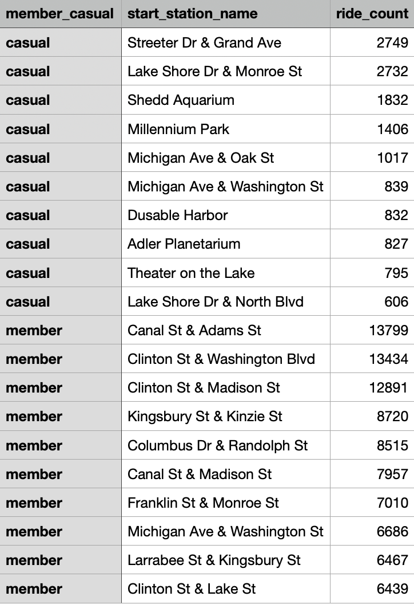

# Case Study: Cyclistic Bike-Share Analysis (Google Data Analytics Capstone)

## Introduction

This project analyzes the Cyclistic Bike-Share case study, developed as part of the Google Data Analytics Professional Certificate capstone. The objective is to answer key business questions by applying the six-step data analysis process: Ask, Prepare, Process, Analyze, Share, and Act.

## Background

Cyclistic is a bike-share program based in Chicago, offering 5,824 bicycles and 692 docking stations throughout the city. Unlike many competitors, Cyclistic provides a variety of bicycle types—including reclining bikes, hand tricycles, and cargo bikes—designed to accommodate riders with different needs, making the service more inclusive and accessible.

The company offers flexible pricing plans, including single-ride passes, full-day passes, and annual memberships. While this approach appeals to a broad range of users, the company’s marketing director believes that long-term success depends on increasing the number of annual members.

## Scenario

For the purposes of this case study, I assume the role of a junior data analyst on Cyclistic’s marketing analytics team. The objective is to analyze rider behavior and present findings and recommendations to key stakeholders, including Marketing Director Lily Moreno and the Cyclistic executive team.
 
## Step 1: Ask

The business task is to analyze how annual members and casual riders use Cyclistic bikes differently. By identifying usage patterns over time, the marketing team can develop targeted strategies aimed at converting more casual riders into annual members. 

## Step 2: Prepare

### Does the Data ROCCC?

To ensure the quality of this analysis, the data must be Reliable, Original, Comprehensive, Current, and Cited (ROCCC). The dataset used in this project consists of historical trip data from Divvy, Chicago’s bike-share system, covering Q1 of 2019 and Q1 of 2020. The data was made publicly available by Motivate International Inc. under their Data License Agreement.

Due to storage and processing limitations in the free version of RStudio, only Q1 data from each year was used. The data is public and anonymized to protect riders' privacy. It excludes any personally identifiable information such as names, phone numbers, or payment details.

Applying the ROCCC framework:
- Reliable & Original: The data comes directly from a primary source (Divvy) and reflects actual trip history.
- Comprehensive: It includes all necessary fields to analyze usage patterns between member types.
- Current: Although the data is from 2019 and 2020, it remains useful for identifying general behavioral trends.
- Cited: The data source is publicly documented and licensed appropriately.

### Preparing RStudio

The analysis was conducted in R using the RStudio environment. To begin, the necessary packages were installed and loaded. The tidyverse package provides essential tools for data manipulation and visualization, while the conflicted package helps resolve function name conflicts across packages.

The conflict_prefer() function was used to ensure consistent use of filter() and lag() from the dplyr package.

```r
# Install necessary packages
install.packages("tidyverse")
install.packages("conflicted")
library(tidyverse) 
library(conflicted)

# Set dplyr::filter and dplyr::lag as the default choices
conflict_prefer("filter", "dplyr")
conflict_prefer("lag", "dplyr")
```

The datasets were then imported using the read_csv() function

```r
# Using read_csv, create dataframes for each year
q1_2019 <- read_csv("Divvy_Trips_2019_Q1.csv")
q1_2020 <- read_csv("Divvy_Trips_2020_Q1.csv")
```

## Step 3: Process

The Process step involves cleaning and transforming the raw datasets to ensure they are accurate, consistent, and ready for analysis. Key tasks included removing incomplete or inaccurate records, standardizing column names and data types across years, and filtering out test data.

During initial inspection, inconsistencies were observed between the 2019 and 2020 datasets—specifically in column names and data formats. Additionally, some records contained negative ride durations or referred to test stations (e.g., “HQ QR”), which were removed to maintain data quality.

### Renaming columns and Aligning Data Types 

The 2019 dataset used a different column naming convention than the 2020 dataset. To enable consistent analysis and allow for accurate row-binding, the 2019 columns were renamed to match the 2020 schema. In addition, the ride_id and rideable_type columns were converted to character data types to ensure compatibility during the merge.

```r
# Rename columns to make them consistent with q1_2020
q1_2019 <- rename(q1_2019
                   ,ride_id = trip_id
                   ,rideable_type = bikeid
                   ,started_at = start_time
                   ,ended_at = end_time
                   ,start_station_name = from_station_name
                   ,start_station_id = from_station_id
                   ,end_station_name = to_station_name
                   ,end_station_id = to_station_id
                   ,member_casual = usertype)

# Convert ride_id and rideable_type to character so that they can stack correctly
q1_2019 <-  mutate(q1_2019, ride_id = as.character(ride_id)
                   ,rideable_type = as.character(rideable_type))
```

### Combining Datasets

After renaming columns and aligning data types, the Q1 datasets from 2019 and 2020 were combined into a single data frame named all_trips. This unified dataset includes all the cleaned trip records and will serve as the basis for all subsequent analysis.

```r
# Stack individual quarter's data frames
all_trips <- bind_rows(q1_2019, q1_2020)
```

### Removing Unwanted Columns

To maintain consistency between the datasets and focus the analysis on relevant variables, non-essential columns such as geographic coordinates (start_lat, start_lng, end_lat, end_lng), demographic information (birthyear, gender), and tripduration (which will be recalculated) were removed. These columns were either dropped from the 2020 data or deemed unnecessary for this analysis.

```r
# Remove non essential columns
all_trips <- all_trips %>%  
  select(-c(start_lat, start_lng, end_lat, end_lng, birthyear, gender, tripduration))
```

### Standardizing user type data

To coordinate the user type labels across both datasets, the 2019 labels “Subscriber” and “Customer” were recoded to match the 2020 labels “member” and “casual”, respectively. This ensures consistency when analyzing user behavior by user type.

```r
# Standardize user type labels
all_trips <-  all_trips %>% 
  mutate(member_casual = recode(member_casual,"Subscriber" = "member","Customer" = "casual"))
```

### Adding columns

To enable granular time-based analysis, new columns were created by extracting the date, month, day, year, and day of the week from the started_at timestamp. Additionally, a ride_length column was calculated as the duration of each trip in minutes, rounded to two decimal places. This will allow us to analyze usage patterns over time and compare trip durations.

```r
# Add columns that list the date, month, day, and year of each ride
all_trips$date <- as.Date(all_trips$started_at)
all_trips$month <- format(as.Date(all_trips$date), "%m")
all_trips$day <- format(as.Date(all_trips$date), "%d")
all_trips$year <- format(as.Date(all_trips$date), "%Y")
all_trips$day_of_week <- format(as.Date(all_trips$date), "%A")

# Add a ride_length calculation to all_trips, specificy unit is minutes and round to two decimal places
all_trips$ride_length <-round(as.numeric(difftime(all_trips$ended_at, all_trips$started_at, units = "mins")), 2)
```

### Cleaning combined dataset

To ensure data quality, trips with negative ride durations and those starting at the “HQ QR” station—a known test/placeholder location—were removed. These entries could distort analysis results and are considered invalid for this study. A new dataframe, all_trips_v2, was created with these records filtered out. 

```r
# Create a new dataframe (all_trips_v2) to filter out invalid entries
# Remove rides with negative duration and the 'HQ QR' station, which is known to be a test/placeholder station
all_trips_v2 <- all_trips[!(all_trips$start_station_name == "HQ QR" | all_trips$ride_length<0),]
```

## Step 4: Analyze

### Descriptive Analysis on ride length by user type

Key descriptive statistics for ride length (in minutes) were calculated separately for casual and member riders. These statistics—including mean, median, minimum, and maximum ride lengths—help reveal differences in usage patterns between the two groups. The dataframe was also exported as a CSV file for further use.

```r
# Create a new data frame with all the key statistics, rounded to 2 decimal places
summary_stats_df <- all_trips_v2 %>%
  group_by(member_casual) %>%
  summarise(
    mean_length = round(mean(ride_length), 2),
    median_length = round(median(ride_length), 2),
    min_length = round(min(ride_length), 2),
    max_length = round(max(ride_length), 2)
  )

# Export the dataframe to a csv file
write_csv(summary_stats_df, "summary_ride_statistics_tidy.csv")
```

Below is a summary table illustrating the mean, median, minimum, and maximum ride lengths for casual and member riders.


### Average Ride Length (Minutes) and total number of rides by user type and weekday

The average ride length (in minutes) and total number of rides were calculated for each weekday, broken down by user type. Understanding these patterns can help identify which days see heavier usage and how ride durations vary between casual and member riders throughout the week. The dataframe was also exported as a CSV file.

```r
# Create a new data frame with total number of rides and average ride length by weekday and user type
rides_duration_and_count <- all_trips_v2 %>%
  mutate(weekday = wday(started_at, label = TRUE)) %>%
  group_by(member_casual, weekday) %>%
  summarise(
    number_of_rides = n(),
    average_duration = round(mean(ride_length), 2), # Rounded to 2 decimal places
    .groups = 'drop'
  ) %>%
  arrange(member_casual, weekday)

# Export the dataframe to a csv file
write_csv(rides_duration_and_count, "daily_rides_and_duration_summary.csv")
```

The table below illustrates the total number of rides and average ride duration for each weekday, categorized by user type.


### Analyzing monthly usage trends

The total number of rides for each user type was calculated across the months in the dataset. A dataframe was created summarizing these counts and exported as a CSV file.

```r
# Group the data by user type and month, then summarize the total number of rides
monthly_rides <- all_trips_v2 %>%
  group_by(member_casual, month) %>%
  summarise(number_of_rides = n()) %>%
  arrange(month, member_casual)

# Export the dataframe to a csv file
write_csv(monthly_rides, "monthly_rides_summary.csv")
```

The table below illustrates the total number of rides by month (where 1 = January, 2 = February, 3 = March) and user type.


### Analyzing hourly usage trends

The number of rides for each user type was calculated by hour of the day (using 24-hour format). A dataframe summarizing these counts was created and exported as a CSV file.

```r
# Group the data by user type and hour, then sumarize the total number of rides
hourly_data <- all_trips_v2 %>%
  mutate(hour = lubridate::hour(started_at)) %>%
  group_by(member_casual, hour) %>%
  summarise(number_of_rides = n())

# Export the dataframe to a csv file
write_csv(hourly_data, "hourly_rides_by_user_type.csv")
```

The table below illustrates the number of rides by hour of the day (0 = 12:00 AM, 1 = 1:00 AM, and so on) and user type.


### Analyzing top 10 start stations 

The top 10 most popular starting stations were calculated separately for casual and member riders. A dataframe was created summarizing these counts and exported as a CSV file.

```r
# Create a data frame showing the top 10 start stations for each user type
top_starts_by_user <- all_trips_v2 %>%
  group_by(member_casual, start_station_name) %>%
  summarise(ride_count = n(), .groups = 'drop') %>%
  arrange(member_casual, desc(ride_count)) %>%
  group_by(member_casual) %>%
  slice_head(n = 10)

# Export the dataframe to a csv file
write_csv(top_starts_by_user, "top_10_start_stations_by_user.csv")
```

Below is a table that illustrates the top 10 stations based on user type and ride count.



## Step 5: Share

### Total Number of rides each day of the week by user type

A grouped bar chart was created using ggplot2 to visualize the number of rides with bars grouped by "weekday" and colored by "member_casual". 

```r
# Visualize the number of rides by rider type and weekday
all_trips_v2 %>% 
  mutate(weekday = wday(started_at, label = TRUE)) %>% 
  group_by(member_casual, weekday) %>% 
  summarise(number_of_rides = n()
            ,average_duration = mean(ride_length)) %>% 
  arrange(member_casual, weekday) %>% 
  ggplot(aes(x = weekday, y = number_of_rides, fill = member_casual)) +
  geom_col(position = "dodge") +
  labs(title = "Number of Rides by Weekday")
```

CHART

### Averaege ride length each day of the week by user type

Another grouped bar chart was created using ggplot2 to visualizae the averaege ride lenghth with bars grouped by "weekday" and colored by "member_casual"

```r
all_trips_v2 %>% 
  mutate(weekday = wday(started_at, label = TRUE)) %>% 
  group_by(member_casual, weekday) %>% 
  summarise(number_of_rides = n()
            ,average_duration = mean(ride_length)) %>% 
  arrange(member_casual, weekday)  %>% 
  ggplot(aes(x = weekday, y = average_duration, fill = member_casual)) +
  geom_col(position = "dodge") +
  labs(title = "Average Duration by Weekday")
 ``` 
CHART

### Total number of rides each month by user type

A third grouped bar chart was created using ggplot2 to compare the total number of rides between "casual" and "member" user types across the three months of data.

```r
ggplot(monthly_rides, aes(x = month, y = number_of_rides, fill = member_casual)) +
  geom_col(position = "dodge") +
  labs(title = "Monthly Rides by Rider Type",
       x = "Month",
       y = "Number of Rides")
 ``` 

CHART

### Total number of rides each hour of the day by user type

A fourth grouped bar chart was also creatted using ggplot2 to compare the number of rides betwene "casual" and "member" user types across the 24 hours of the day.

```r
ggplot(hourly_data, aes(x = hour, y = number_of_rides, fill = member_casual)) +
  geom_col(position = "dodge") +
  labs(title = "Hourly Rides by Rider Type",
       x = "Hour of Day (24-hour clock)",
       y = "Number of Rides") +
  scale_x_continuous(breaks = seq(0, 23, by = 1))
```

CHART

### Top 10 starting stations by rider type

```r
# Create a data frame showing the top 10 start stations for each user type
top_starts_by_user <- all_trips_v2 %>%
  group_by(member_casual, start_station_name) %>%
  summarise(ride_count = n(), .groups = 'drop') %>%
  arrange(member_casual, desc(ride_count)) %>%
  group_by(member_casual) %>%
  slice_head(n = 10)
```

CHART
